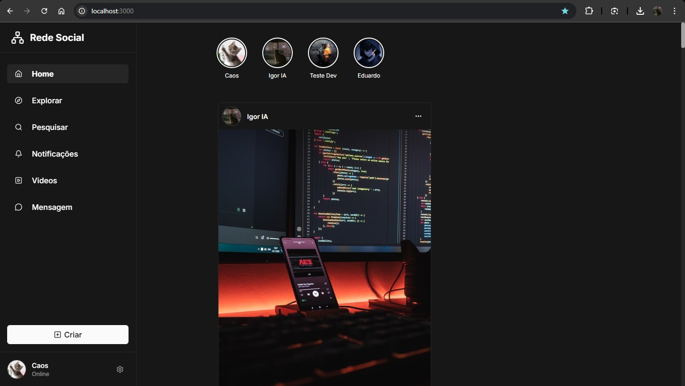
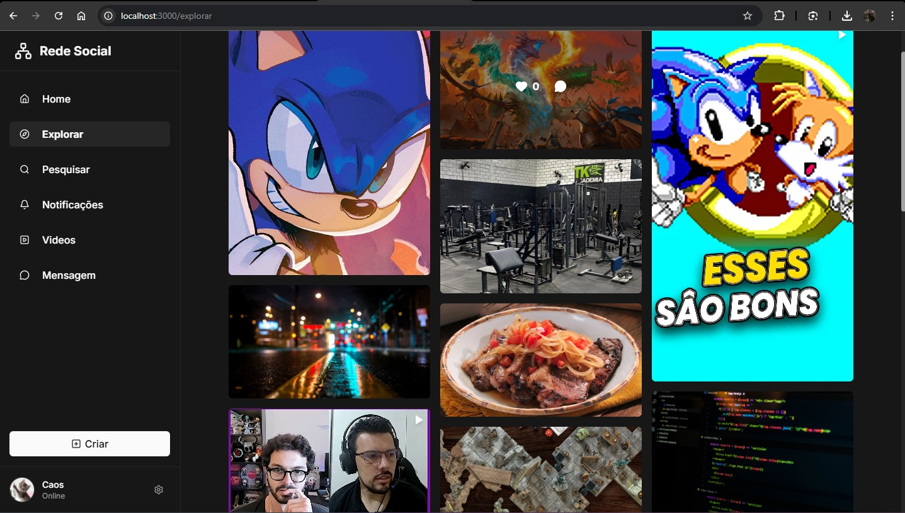
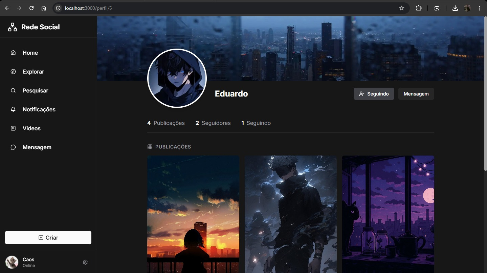
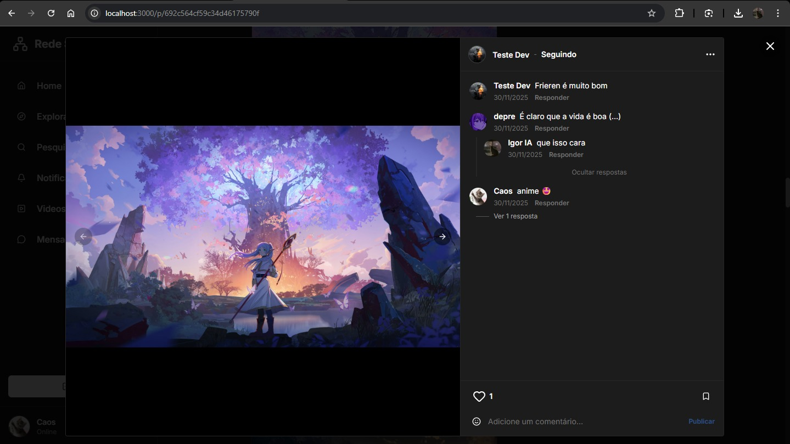
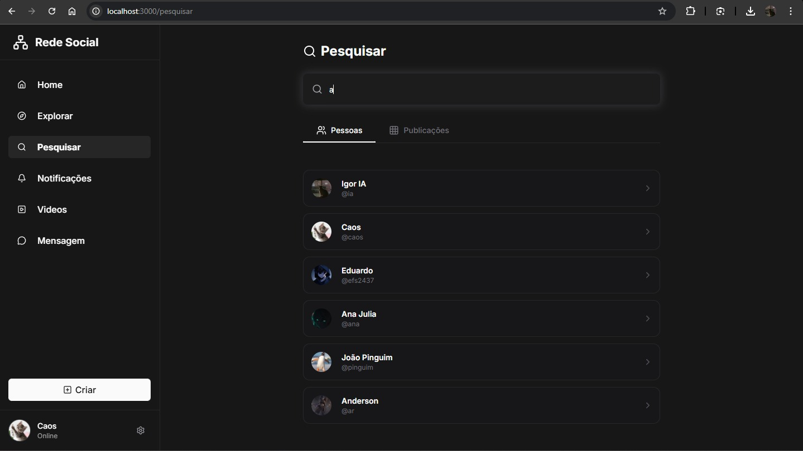
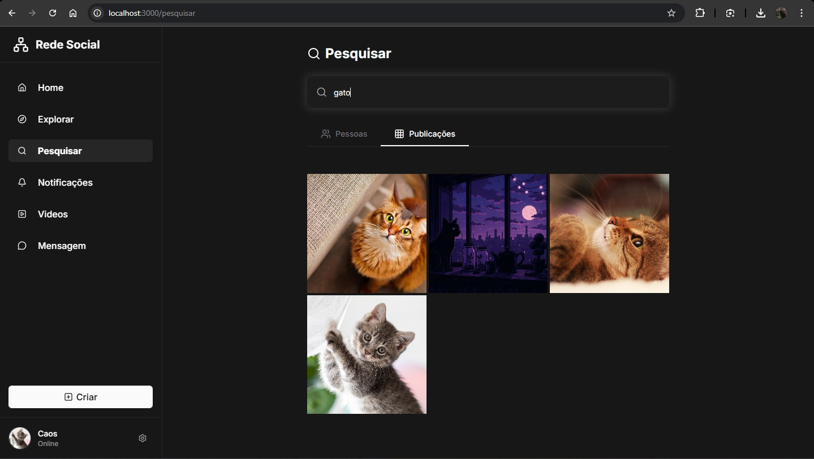
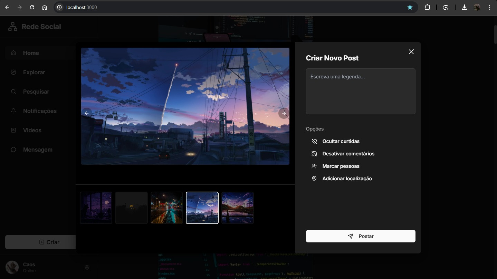
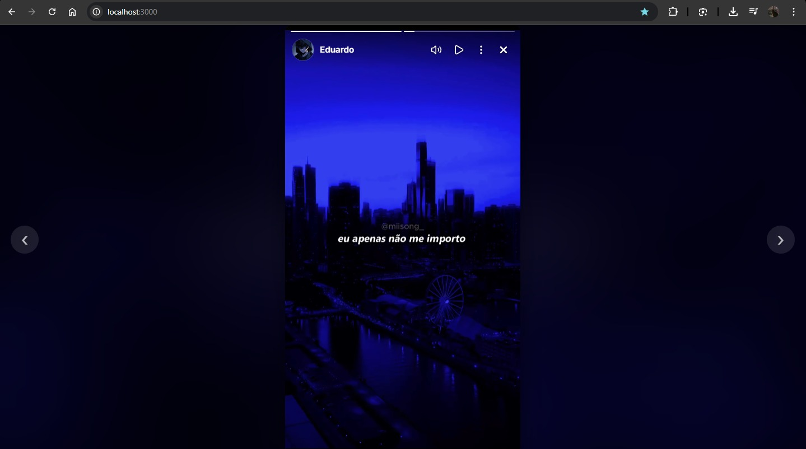

# Social Network Project

Uma aplicação de rede social completa e moderna, desenvolvida com foco em escalabilidade, experiência do usuário e uma arquitetura de backend robusta utilizando persistência poliglota e processamento assíncrono.

<br>
    
<br>

## 🎥 Demonstração do Projeto

Confira o funcionamento completo da aplicação no vídeo abaixo:

<div align="center">
  <a href="https://www.youtube.com/watch?v=m1rha35vZGc" target="_blank">
    
  </a>
</div>

## 🖥️ Visão Geral do Frontend

A interface da aplicação foi construída com diversas tecnologias modernas e pensando em performance, escalabilidade e responsividade para experiência do usuário, contando com sistema de login e cadastro, tela principal que contêm um menu de navegação e o feed que terá os status e posts dos seus seguidores o visual bem baseado nas redes sociais existente o foco do projeto era treino e aprendizagem não inovação. Também contando com tela de perfil, de pesquisa por imagem ou por contas, um sistema de links de post podendo abrir o modal do post apenas com o link dele igual mento para o perfil do usuário, e um tela de explorar com diversos postes novos. O sistema conta com sistema de recomendação, uma IA para identificação imagens, e diversos recursos pensando em performance.

### Principais Funcionalidades da Interface:
* **Feed Infinito:** Carregamento dinâmico de postagens conforme o usuário rola a página.
* **Stories (Status):** Visualizador de status imersivo com navegação automática e suporte a vídeos e imagens, similar ao Instagram/WhatsApp.
* **Interações em Tempo Real:** Curtidas, comentários e notificações são refletidos instantaneamente na tela.
* **Modais Interativos:** Criação de posts, visualização de detalhes e configurações abrem em sobreposição, mantendo o contexto da navegação.
* **Design Responsivo:** Layout adaptável construído com **Tailwind CSS**, garantindo acessibilidade em desktops e dispositivos móveis.
* **Componentes Reutilizáveis:** Interface construída com a biblioteca **Shadcn/ui**, garantindo consistência visual e acessibilidade.

### Galeria de Telas
<table>
  <tr>
    <td width="50%">
      <h3 align="center">Home & Feed</h3>
      <div align="center">
        
      </div>
    </td>
    <td width="50%">
      <h3 align="center">Explorar</h3>
      <div align="center">
        
      </div>
    </td>
  </tr>
  <tr>
    <td width="50%">
      <h3 align="center">Perfil do Usuário</h3>
      <div align="center">
        
      </div>
    </td>
    <td width="50%">
      <h3 align="center">Visualização de Post</h3>
      <div align="center">
        
      </div>
    </td>
  </tr>
  <tr>
    <td width="50%">
      <h3 align="center">Pesquisa de Usuários</h3>
      <div align="center">
        
      </div>
    </td>
    <td width="50%">
      <h3 align="center">Pesquisa por Imagens</h3>
      <div align="center">
        
      </div>
    </td>
  </tr>
  <tr>
    <td width="50%">
      <h3 align="center">Criando Conteúdo</h3>
      <div align="center">
        
      </div>
    </td>
    <td width="50%">
      <h3 align="center">Visualizando Status</h3>
      <div align="center">
        
      </div>
    </td>
  </tr>
</table>

## ⚙️ Arquitetura Técnica do Backend

O backend deste projeto se destaca pela implementação de **Persistência Poliglota** e uma arquitetura orientada a eventos, garantindo que cada tipo de dado seja armazenado na tecnologia mais adequada para sua finalidade.

### 1. Persistência de Dados (3 Bancos de Dados)
A aplicação orquestra três bancos de dados distintos simultaneamente:

* **MySQL (Relacional):** Utilizado via **Sequelize** para dados estruturados e críticos, como a autenticação de usuários (Login/Cadastro) e informações básicas de perfil. Garante a integridade ACID das contas.
* **MongoDB (Documento):** Utilizado via **Mongoose** para armazenar dados volumosos e semi-estruturados, como o conteúdo das postagens, comentários e o sistema de Status. Ideal para a flexibilidade de mídia e leitura rápida do feed.
* **Neo4j (Grafo):** Utilizado para mapear as complexas relações sociais. O sistema de "Seguir/Seguindo" e o motor de recomendações ("Pessoas que você talvez conheça") são processados aqui, aproveitando a eficiência de grafos para queries de relacionamento.

### 2. Processamento Assíncrono e Filas (RabbitMQ)
Para não bloquear a experiência do usuário e garantir performance, operações pesadas são delegadas para "Workers" através de filas de mensagens com **RabbitMQ**.

* **Worker de IA (TensorFlow.js):** Ao fazer upload de uma imagem, ela é enviada para uma fila. Um worker consome essa mensagem e utiliza o modelo `coco-ssd` para analisar a imagem e gerar tags automáticas (ex: "gato", "pessoa", "carro") para o sistema de busca.
* **Worker de Sincronização:** Garante a consistência eventual entre o MySQL e o MongoDB. Se um usuário altera a foto de perfil no MySQL, o evento é propagado para atualizar a foto nos posts antigos armazenados no MongoDB.
* **Worker de Interações:** Processa likes e follows de forma desacoplada para evitar sobrecarga no banco principal.

### 3. Comunicação em Tempo Real (Socket.IO)
Um servidor dedicado de WebSocket escuta eventos do RabbitMQ e notifica o frontend instantaneamente. Isso permite que, quando um usuário faça um post ou comentário, outros usuários conectados recebam a atualização sem precisar recarregar a página.

---

## 🛠️ Tecnologias Utilizadas

### Stack Principal
* **Frontend:** React, Next.js, TypeScript, Tailwind CSS, Shadcn/ui, Lucide React.
* **Backend:** Node.js, Next.js API Routes.
* **AI:** TensorFlow.js (Classificação de Imagens).

### Infraestrutura
* **MySQL** (Dados de Usuário)
* **MongoDB** (Posts e Mídia)
* **Neo4j** (Grafo Social)
* **RabbitMQ** (Mensageria e Filas)
* **Docker & Docker Compose** (Orquestração de Containers)
* **Socket.IO** (Real-time)

---

## 🚀 Como Executar o Projeto

Este projeto utiliza **Docker** para subir toda a infraestrutura necessária (bancos de dados e filas). Siga os passos abaixo:

### Pré-requisitos
* Node.js instalado (v18+)
* Docker e Docker Compose instalados

### Passo a Passo

1.  **Clone o repositório:**
    ```bash
    git clone [https://github.com/eduardofranco572/project-social-network.git](https://github.com/eduardofranco572/project-social-network.git)
    cd project-social-network
    ```

2.  **Configure as variáveis de ambiente:**
    Duplique o arquivo `.env.example`, renomeie para `.env` e preencha conforme necessário (as configurações padrão do Docker já estão sugeridas no arquivo).

3.  **Suba a infraestrutura (Bancos e RabbitMQ):**
    Execute o comando abaixo para baixar as imagens e iniciar os containers do MySQL, Mongo, Neo4j, RabbitMQ e o Servidor de Socket:
    ```bash
    docker-compose up -d
    ```
    *Aguarde alguns instantes para que todos os serviços (especialmente o MySQL e Neo4j) estejam prontos.*

4.  **Instale as dependências do projeto:**
    ```bash
    npm install
    ```

5.  **Sincronize o Banco de Dados (MySQL):**
    Este comando criará as tabelas necessárias no MySQL:
    ```bash
    npm run sync-db
    ```

6.  **Inicie a Aplicação (Frontend e API):**
    ```bash
    npm run dev
    ```

Acesse a aplicação em: `http://localhost:3000`

---

# Integrantes da dupla:
- Eduardo Franco Seco (Full-Stack) <br>
  [](https://github.com/eduardofranco572)
  [](https://www.linkedin.com/in/eduardo-franco572/)

- Igor Albiero (Back-End) <br>
  [](https://github.com/igorskeff)
  [](https://www.linkedin.com/in/igor-albiero-7178a5215/)
